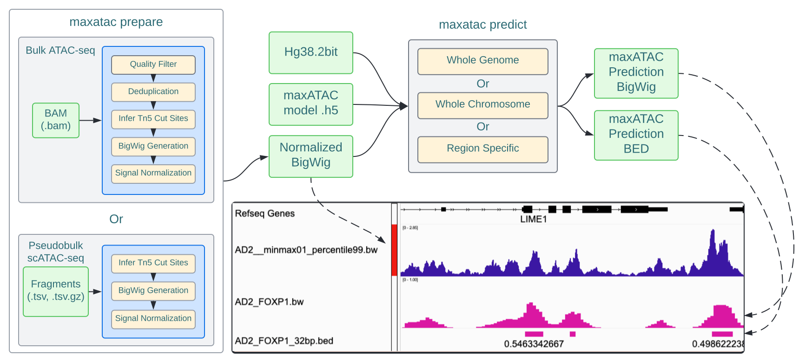

# quant-maxATAC: genome-scale transcription-factor binding prediction from ATAC-seq with deep neural networks

## Introduction

Quant-maxATAC is a code base for quantitative transcription factor (TF) binding prediction from ATAC-seq signal and DNA sequence in *human* cell types. Quant-maxATAC builds upon the original python package maxATAC, and it too works with both population-level (bulk) ATAC-seq and pseudobulk ATAC-seq profiles derived from single-cell (sc)ATAC-seq. Quant-maxATAC quantitatively models ChIP-seq signal in the context of cross-cell type TF binding site TFBS prediction at 32 bp resolution form ATAC-seq data. 


### Rationale for quant-maxATAC and quantitative modeling of TF ChIP-seq signal


(A) The quantitative maxATAC (“quant-maxATAC”) models predict TF ChIP-seq signal from ATAC-seq and genomic sequence inputs. As is standard for deep learning, gradient-based algorithms are used to tune model parameters according to training loss. (B) In maxATAC-v1, models were trained using cross-entropy loss and binary TFBS targets (peak calls), where “mistakes” for ChIP-seq peaks (i) and (ii) would contribute equally to parameter tuning, even though peak (i) has more ChIP-seq signal than peak (ii) (i.e., is higher confidence, corresponds to larger fold-change over background signal). Thus, instructive, quantitative ChIP-seq signal is not leveraged with binary modeling. In a similar vein, region (iii) shows below-threshold peak signal that may reflect a low-affinity TF binding site (e.g., expected to be bound by only a subset of cells in the population). This below-threshold signal may also be instructive in model training but cannot be leveraged by binary TFBS modeling. In contrast, training with quantitative loss on ChIP-seq signal would avoid arbitrary peak-call thresholds and enable more efficient training. These observations motivate the evaluation of quantitative TFBS targets and loss functions in this study. Data shown depict CEBPB TF ChIP-seq signal (linear fold-change) and ChIP-seq peak calls in A549 cells.  


quant-maxATAC requires three inputs:

* DNA sequence, in [`.2bit`](https://genome.ucsc.edu/goldenPath/help/twoBit.html) file format.
* ATAC-seq signal, processed as described [below](#Preparing-your-ATAC-seq-signal).
* Trained quant-maxATAC TF Models, in [`.h5`](https://www.tensorflow.org/tutorials/keras/save_and_load) file format.

> **quant-maxATAC was trained and evaluated on data generated using the hg38 reference genome. The default paths and files that are used for each function will reference hg38 files. If you want to use quant-maxATAC with any other species or reference, you will need to provide the appropriate chromosome sizes file, blacklist, and `.2bit` file specific to your data.**

___

## Installation

It is best to install quant-maxATAC into a dedicated virtual environment.

This version requires python 3.9, `bedtools`, `samtools`, `pigz`, `wget`, `git`, `graphviz`, and `ucsc-bedgraphtobigwig` in order to run all functions.

> The total install data requirements are ~2 GB.

### Installing with Conda

1. Create a conda environment with `conda create -n maxatac -c bioconda python=3.9 samtools wget bedtools ucsc-bedgraphtobigwig pigz`

> If you get an error regarding graphviz while training a model, re-install graphviz with `conda install graphviz`

2. A. To install quant-maxATAC with first install the packages and their specific versions in requirements.txt file `pip install -r packaging/constraints/py3.9_requirements_20240807.txt`
   B. Once the requirements are installed then install quant-maxatac with `pip install .`

3. Test installation with `maxatac -h`

4. Download reference data with `maxatac data`

> If you have an error related to pybigwig, reference issues: [96](https://github.com/MiraldiLab/maxATAC/issues/96) and [87](https://github.com/MiraldiLab/maxATAC/issues/87#issue-1139117054)

### Downloading required reference data

In order to run the quant-maxATAC models, the model files required can be found in [quant-maxATAC_data](https://github.com/MiraldiLab/quant-maxATAC_data) repository and installed in the correct directory:

* hg38 reference genome `.2bit` file
* hg38 chromosome sizes file
* maxATAC extended blacklist
* TF specific `.h5` model files
* TF specific thresholding files
* Bash scripts for preparing data

The easiest option is to use the command `maxatac data` to download the data to the required directory. The `maxatac data` function will download the quant-maxATAC_data repo and reference data into your `~/opt/` directory under `~/opt/maxatac`. Only the hg38 reference genome has been extensively tested.

#### Using custom reference data

The directory `~/opt/maxatac/data` is the default location where quant-maxATAC will look for the quant-maxATAC models, hg38 reference annotations, etc.

If you want to use your own references (e.g., hg19) or models, set the appropriate flags for each file with the path to your custom files. You can also adjust the relative paths in `constants.py` to be the default values for all functions.

___

## Quick Start Overview



>*Schematic: Overview of a typical maxATAC workflow. First, ATAC-seq data is prepared using the maxatac prepare function. The prepare function processes bulk and scATAC-seq into normalized signal files. The normalized signal track can then be used to make TF binding predictions for the TF of interest. The IGV screenshot shows the maxATAC-normalized ATAC-seq signal (blue) and maxATAC TFBS predictions for the FOXP1 model (magenta), predictions are represented as signal tracks (.bw, bigwig) and TFBS (.bed files), the default outputs from maxATAC.*

### Inputs

* DNA sequence, in [`.2bit`](https://genome.ucsc.edu/goldenPath/help/twoBit.html) file format.
* ATAC-seq signal, processed as described [below](#preparing-the-atac-seq-signal).
* Trained quant-maxATAC TF Models, in [`.h5`](https://www.tensorflow.org/tutorials/keras/save_and_load) file format.

### Outputs

* Raw maxATAC TFBS scores tracks in [`.bw`](https://genome.ucsc.edu/FAQ/FAQformat.html#format6.1) file format.
* [`.bed`](https://genome.ucsc.edu/FAQ/FAQformat.html#format1) file of TF binding sites, thresholded according to a user-supplied confidence cut off (e.g., corresponding to an estimated precision, recall value or $log_2(precision:precision_{random} > 7$) or default ($max(F1score)$)).

## ATAC-seq Data Requirements

As described in the [maxATAC publication](https://journals.plos.org/ploscompbiol/article?id=10.1371/journal.pcbi.1010863), **maxATAC processing of ATAC-seq signal is critical to maxATAC prediction**. Key maxATAC processing steps, summarized in a single command [`maxatac prepare`](./docs/readme/prepare.md#Prepare), include identification of Tn5 cut sites from ATAC-seq fragments, ATAC-seq signal smoothing, filtering with an extended "maxATAC" blacklist, and robust, min-max-like normalization. 

The quant-maxATAC models were trained on paired-end ATAC-seq data in human. For this reason, we recommend paired-end sequencing with sufficient sequencing depth (e.g., ~20M reads for bulk ATAC-seq). Until these models are benchmarked in other species, we recommend limiting their use to human ATAC-seq datasets. 

### Preparing the ATAC-seq signal

The current `maxatac predict` function requires a normalized ATAC-seq signal in a bigwig format. Use `maxatac prepare` to generate a normalized signal track from a `.bam` file of aligned reads. See [the prepare documentation](./docs/readme/prepare.md) for more details about the expected outputs and file name descriptions.

#### Bulk ATAC-seq

The function `maxatac prepare` was designed to take an input BAM file that has aligned to the hg38 reference genome. The inputs to `maxatac prepare` are the input bam file, the output directory, and the filename prefix.

```bash
maxatac prepare -i SRX2717911.bam -o ./output -prefix SRX2717911 -dedup
```

This function took 38 minutes for a sample with 52,657,164 reads in the BAM file. This was tested on a 2019 Macbook Pro with a 2.6 GHz 6-Core Intel Core i7 and 16 GB of memory.

#### Pseudo-bulk scATAC-seq

First, convert the `.tsv.gz` output fragments file from CellRanger into pseudo-bulk specific fragment files. Then, use `maxatac prepare` with each of the fragment files in order to generate a normalized bigwig file for input into `maxatac predict`.

```bash
maxatac prepare -i HighLoading_GM12878.tsv -o ./output -prefix HighLoading_GM12878
```

The prediction parameters and steps are the same for scATAC-seq data after normalization.

## Predicting TF binding from ATAC-seq

Following maxATAC-specific processing of ATAC-seq signal inputs, use the [`maxatac predict`](./docs/readme/predict.md#Predict) function to predict TF binding with a maxATAC model.

TF binding predictions can be made genome-wide, for a single chromosome, or, alternatively, the user can provide a `.bed` file of genomic intervals for maxATAC predictions to be made.

### Whole genome prediction

Example command for TFBS prediction across the whole genome:

```bash
maxatac predict -tf CTCF --signal GM12878_IS_slop20_RP20M_minmax01.bw -o outputdir/
```

If data has been installed with maxATAC data, then the following command will use the best model and call peaks using the TF specific threshold statistics. 

```bash
maxatac predict -tf CTCF -s GM12878_IS_slop20_RP20M_minmax01.bw  -o outputdir/
```

### Prediction in a specific genomic region(s)

For TFBS predictions within specific regions of the genome, a `BED` file of genomic intervals, `roi` (regions of interest) are supplied:

```bash
maxatac predict -tf CTCF --signal GM12878_IS_slop20_RP20M_minmax01.bw  --roi ROI.bed
```

### Prediction on a specific chromosome(s)

For TFBS predictions on a single chromosome or subset of chromosomes, these can be provided using the `--chromosomes` argument:

```bash
maxatac predict -tf CTCF --signal GM12878_IS_slop20_RP20M_minmax01.bw  --chromosomes chr3 chr5
```

## Raw signal tracks (prediction bigwigs) are large

Each output prediction file for a whole genome is ~700 MB per TF.

The output bed files are ~60Mb.

There are 127 TF models x ~700MB per TF model = ~88.9 GB of bigwig files for a single ATAC-seq input track. (Note: it only makes sense to generate maxATAC predicitons for TFs expressed in your cell type / conditions of interest, so this is a worst-case estimate.)

___

## quant-maxATAC functions

| Subcommand                                          | Description                                    |
|-----------------------------------------------------|------------------------------------------------|
| [`prepare`](./docs/readme/prepare.md#Prepare)       | Prepare input data                             |
| [`average`](./docs/readme/average.md#Average)       | Average ATAC-seq signal tracks                 |
| [`normalize`](./docs/readme/normalize.md#Normalize) | Minmax normalize ATAC-seq signal tracks        |
| [`train`](./docs/readme/train.md#Train)             | Train a model                                  |
| [`predict`](./docs/readme/predict.md#Predict)       | Predict TF binding                             |
| [`benchmark`](./docs/readme/benchmark.md#Benchmark) | Benchmark maxATAC predictions against ChIP-seq |
| [`peaks`](./docs/readme/peaks.md#Peaks)             | Call "peaks" on maxATAC signal tracks          |
| [`variants`](./docs/readme/variants.md#Variants)    | Predict sequence specific TF binding           |

___

## Publication

The quant-maxATAC mansucripot (Rizvi et al. 2025) is currently under review. The maxATAC-v1 manuscript is available on [PLoS Computational Biology](https://journals.plos.org/ploscompbiol/article?id=10.1371/journal.pcbi.1010863). 

